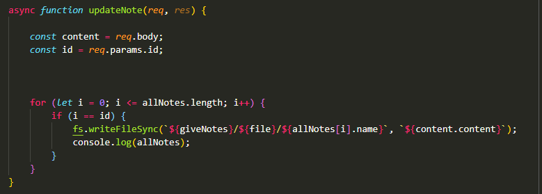

## Create Note
Esta funcion te permite crear una nota pasando el nombre por parametros y el contenido desde el body

 

## DeleteNote
Esta funcion te permite borrar una nota pasando su id por parametros 

 

## getToken
Esta funcion te permite generar y obtener un token

 

## UpdateNote
Esta funcion te permite editar una nota pasando su id por parametros y modificar su contenido desde el body

 

## getFiles
Esta funcion te permite recoger todos los archivos

 

# verify
Esta funcion te permite verificar si el token que estas usando es valido y inicias como admin
 